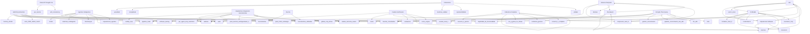

<!-- Auto-generated by vault.py viz on 2026-05-23 22:06 -->

# Knowledge Graph

```mermaid
graph TD
  add_only_extraction["Add Only Extraction"]
  add_only_extraction --> memory_blocks
  add_only_extraction --> aletheia
  add_only_extraction --> vault
  add_only_extraction --> pipeline_maid
  add_only_extraction --> estado_memoria_sesion
  add_only_extraction --> fuentes_consultadas
  add_only_extraction --> duplicidad_de_funcionalidad
  add_only_extraction --> context_nivel_1
  add_only_extraction --> arxiv_2504_19413_mem0
  adr["Adr"]
  adr --> c4_model
  adr --> arquitectura_software
  adr --> vector_store
  adr --> duplicidad_de_funcionalidad
  adr --> kosmos
  agentes_inteligentes["Agentes Inteligentes"]
  agentes_inteligentes --> aletheia
  agentes_inteligentes --> metis
  agentes_inteligentes --> kratos
  agentes_inteligentes --> pipeline_maid
  agentes_inteligentes --> sistemas_multiagente
  agentes_inteligentes --> mnemosyne
  agentes_inteligentes --> software_testing
  agentes_inteligentes --> kosmos
  agentes_inteligentes --> orquestacion_agentes
  alcance_temporal["Alcance Temporal"]
  alcance_temporal --> fuentes_consultadas
  alcance_temporal --> alcance_temporal
  alcance_temporal --> checkpoint
  alcance_temporal --> idiomas
  arquitectura_integracion_herra["Arquitectura Integracion Herramientas"]
  arquitectura_integracion_herra --> lucidity_mcp
  arquitectura_integracion_herra --> vault
  arquitectura_integracion_herra --> herramientas
  arquitectura_integracion_herra --> pipeline_maid
  arquitectura_integracion_herra --> per_agent_mcp_restriction
  arquitectura_integracion_herra --> herramientas_utilizadas
  arquitectura_integracion_herra --> para_kosmos_testingevaluaci_n
  arquitectura_integracion_herra --> estado_memoria_sesion
  arquitectura_integracion_herra --> para_metis_estrategia
  arquitectura_integracion_herra --> github_mcp_oficial
  arquitectura_integracion_herra --> software_testing
  arquitectura_software["Arquitectura Software"]
  arquitectura_software --> kosmos
  arquitectura_software --> structurizr
  arquitectura_software --> c4_model
  arquitectura_software --> adr
  brecha["Brecha"]
  brecha --> herramientas
  brecha --> herramientas_utilizadas
  c4_model["C4 Model"]
  c4_model --> arquitectura_software
  c4_model --> container_nivel_2
  c4_model --> component_nivel_3
  c4_model --> structurizr
  c4_model --> adr
  c4_model --> code_nivel_4
  c4_model --> kosmos
  c4_model --> context_nivel_1
  c4_model --> structurizr_mcp
  cadena_verificacion["Cadena Verificacion"]
  cadena_verificacion --> aletheia
  cadena_verificacion --> metis
  cadena_verificacion --> component_nivel_3
  cadena_verificacion --> evaluacion
  cadena_verificacion --> kosmos
  cadena_verificacion --> score_engine
  chain_of_thought_cot["Chain Of Thought Cot"]
  chain_of_thought_cot --> par_metros
  chain_of_thought_cot --> self_consistency
  checkpoint["Checkpoint"]
  checkpoint --> fuentes_consultadas
  checkpoint --> alcance_temporal
  checkpoint --> checkpoint
  cobertura_completa["Cobertura Completa"]
  cobertura_completa --> conversi_n_parcial
  cobertura_completa --> pipeline_maid
  cobertura_completa --> cobertura_completa
  cobertura_completa --> sin_p_ginas_hu_rfanas
  cobertura_completa --> confianza_general
  cobertura_completa --> conversi_n_completa
  code_nivel_4["Code Nivel 4"]
  coherencia["Coherencia"]
  coherencia --> veracidad
  coherencia --> completitud
  coherencia --> metricas_calidad
  coherencia --> reproducibilidad
  coherencia --> utilidad
  compile_then_query["Compile Then Query"]
  compile_then_query --> aletheia
  compile_then_query --> metis
  compile_then_query --> vault
  compile_then_query --> gestion_conocimiento
  compile_then_query --> pipeline_conocimiento_raw_wiki
  compile_then_query --> estado_memoria_sesion
  compile_then_query --> llm_wiki
  compile_then_query --> txtai
  compile_then_query --> component_nivel_3
  %% graph truncated to 100 lines
```
