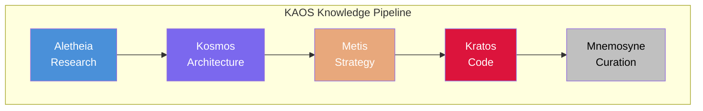

<!-- Auto-generated by vault.py viz on 2026-05-23 13:32 -->

# Pipeline Flow

```mermaid
flowchart LR
  subgraph Pipeline["KAOS Knowledge Pipeline"]
    direction LR
    A[Aletheia<br/>Research] --> K[Kosmos<br/>Architecture]
    K --> M[Metis<br/>Strategy]
    M --> R[Kratos<br/>Code]
    R --> N[Mnemosyne<br/>Curation]
  end
  style A fill:#4A90D9,color:#fff
  style K fill:#7B68EE,color:#fff
  style M fill:#E8A87C,color:#fff
  style R fill:#DC143C,color:#fff
  style N fill:#C0C0C0,color:#000
```
