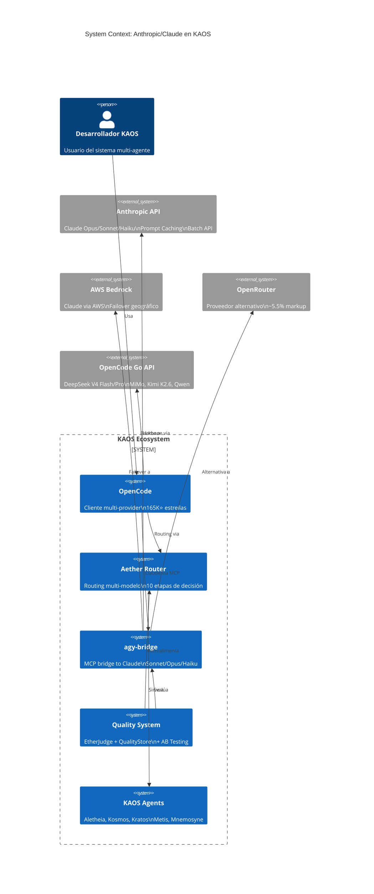
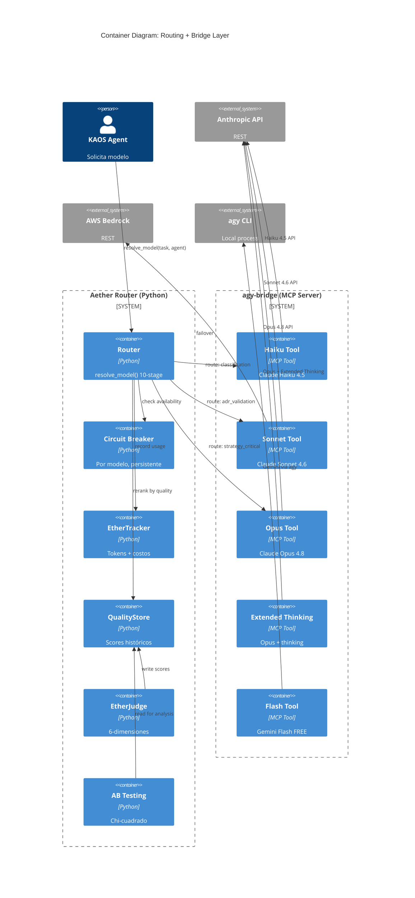

```mermaid
---
title: Arquitectura Anthropic/Claude × KAOS
---
graph TB
    %% CAPA DE ACCESO
    subgraph CAPA_ACCESO["CAPA DE ACCESO"]
        OpenCode["OpenCode TUI/CLI<br/>(165K⭐)"]
        ClaudeCode["Claude Code<br/>(externo, bajo demanda)"]
        Cline["Cline VS+CLI<br/>(62K⭐, MCP nativo)"]
        Agno["Agno Agents<br/>(KAOS nativos)"]
    end

    %% CAPA DE ROUTING
    subgraph CAPA_ROUTING["CAPA DE ROUTING"]
        Aether["AETHER ROUTER v3<br/>16 archivos, lib/aether/"]
        CircuitBreaker["Circuit Breaker<br/>por modelo + persistente"]
        QualityStore["QualityStore<br/>scores históricos"]
        EtherTracker["EtherTracker<br/>tokens + costos"]
        ClaudeRouter["Claude Router<br/>Haiku→Sonnet→Opus"]
    end

    %% CAPA DE PROVEEDORES
    subgraph CAPA_PROVEEDORES["CAPA DE PROVEEDORES CLAUDE"]
        AnthropicDirect["Anthropic Direct<br/>Sonnet 4.6, Opus 4.8, Haiku 4.5<br/>Prompt Caching 90% off<br/>Batch API 50% off"]
        AWSBedrock["AWS Bedrock<br/>+10% regional<br/>failover geográfico"]
        OpenRouter["OpenRouter<br/>~5.5% markup"]
        Izzi["Izzi API<br/>créditos gratis<br/>sin tarjeta"]
        AIcheap["AIcheap.io<br/>$4.99/mes"]
    end

    %% AGY-BRIDGE
    subgraph AGY_BRIDGE["agy-bridge (MCP Server)"]
        Haiku["agy_ask_haiku<br/>Claude Haiku 4.5<br/>→ clasificación"]
        SonnetTool["agy_ask_sonnet<br/>Claude Sonnet 4.6<br/>→ ADRs, review"]
        OpusTool["agy_ask_opus<br/>Claude Opus 4.8<br/>→ estrategia"]
        OpusThinking["agy_ask_opus_thinking<br/>Extended Thinking<br/>→ razonamiento profundo"]
        FlashTool["agy_ask_flash<br/>Gemini 3.5 Flash<br/>→ FREE"]
        GPT55["agy_ask_gpt55<br/>GPT-5.5<br/>→ ChatGPT Plus"]
    end

    %% CAPA DE BACKBONE
    subgraph CAPA_BACKBONE["BACKBONE (DeepSeek/Kimi/MiMo)"]
        DeepSeekFlash["go-flash<br/>DeepSeek V4 Flash<br/>70% tráfico<br/>$0.00014/1K"]
        DeepSeekPro["go-pro<br/>DeepSeek V4 Pro<br/>5% tráfico<br/>$0.00174/1K"]
        Kimi["go-kimi-latest<br/>Kimi K2.6<br/>5% tráfico<br/>$0.00095/1K"]
        MiMo["go-mimo<br/>MiMo V2 Pro<br/>15% tráfico<br/>$0.000014/1K"]
        Qwen["go-qwen<br/>Qwen 3.5 Plus<br/>backup multimodal"]
        Router9["9Router<br/>MiniMax + GLM<br/>ultra-barato"]
    end

    %% CAPA DE OBSERVABILIDAD
    subgraph CAPA_OBSERV["CAPA DE OBSERVABILIDAD"]
        EtherJudge["EtherJudge<br/>6 dimensiones<br/>V/C/CP/R/U"]
        QualityStore2["QualityStore<br/>sampling por tier"]
        ABTesting["AB Testing<br/>chi-cuadrado<br/>min 10 muestras"]
        Dashboard["Ether Dashboard<br/>HTML + CLI"]
        Prometheus["Prometheus Metrics<br/>métricas de sistema"]
    end

    %% CAPA DE HERRAMIENTAS MCP
    subgraph CAPA_MCP["CAPA DE HERRAMIENTAS MCP"]
        GitHub["GitHub MCP"]
        Redis["Redis MCP"]
        PostgreSQL["PostgreSQL MCP"]
        Puppeteer["Puppeteer MCP"]
        Structurizr["Structurizr MCP"]
        Composio["Composio<br/>250+ plataformas"]
        MCPHub["MCP Hub<br/>sources + presets + cache"]
    end

    %% CONEXIONES
    OpenCode --> Aether
    ClaudeCode --> Aether
    Cline --> Aether
    Agno --> Aether

    Aether --> CircuitBreaker
    Aether --> QualityStore
    Aether --> EtherTracker
    Aether --> ClaudeRouter

    ClaudeRouter --> Haiku
    ClaudeRouter --> SonnetTool
    ClaudeRouter --> OpusTool
    ClaudeRouter --> OpusThinking

    Haiku --> AnthropicDirect
    SonnetTool --> AnthropicDirect
    OpusTool --> AnthropicDirect
    OpusThinking --> AnthropicDirect

    SonnetTool -.-> OpenRouter
    SonnetTool -.-> Izzi
    SonnetTool -.-> AIcheap
    OpusTool -.-> AWSBedrock

    ClaudeRouter -.-> DeepSeekFlash
    ClaudeRouter -.-> DeepSeekPro
    ClaudeRouter -.-> Kimi
    ClaudeRouter -.-> MiMo

    Aether --> DeepSeekFlash
    Aether --> DeepSeekPro
    Aether --> Kimi
    Aether --> MiMo
    Aether --> Qwen
    Aether --> Router9

    AGY_BRIDGE --- EtherJudge
    AGY_BRIDGE --- QualityStore2
    Aether --- ABTesting
    Aether --- Dashboard
    Aether --- Prometheus

    OpenCode --> GitHub
    OpenCode --> Redis
    OpenCode --> PostgreSQL
    OpenCode --> Puppeteer
    OpenCode --> Structurizr
    OpenCode --> Composio
    OpenCode --> MCPHub

    %% ESTILOS
    classDef claude fill:#d4a574,stroke:#8b5e3c,stroke-width:2px;
    classDef deepseek fill:#6b8e8e,stroke:#3d5c5c,stroke-width:2px;
    classDef routing fill:#5b7db1,stroke:#2c4f7c,stroke-width:2px;
    classDef observability fill:#8f6bb3,stroke:#5c3d7a,stroke-width:2px;
    classDef mcp fill:#6b9e6b,stroke:#3d6e3d,stroke-width:2px;

    class Haiku,SonnetTool,OpusTool,OpusThinking,AnthropicDirect,AWSBedrock,OpenRouter,Izzi,AIcheap claude;
    class DeepSeekFlash,DeepSeekPro,Kimi,MiMo,Qwen,Router9 deepseek;
    class Aether,CircuitBreaker,QualityStore,EtherTracker,ClaudeRouter routing;
    class EtherJudge,QualityStore2,ABTesting,Dashboard,Prometheus observability;
    class GitHub,Redis,PostgreSQL,Puppeteer,Structurizr,Composio,MCPHub mcp;
```

---

## Diagrama C4 Nivel 1 — Contexto del Sistema

```mermaid
C4Context
    title System Context: Anthropic/Claude en KAOS

    Person(developer, "Desarrollador KAOS", "Usuario del sistema multi-agente")
    
    System_Ext(anthropic, "Anthropic API", "Claude Opus/Sonnet/Haiku\nPrompt Caching\nBatch API")
    System_Ext(bedrock, "AWS Bedrock", "Claude via AWS\nFailover geográfico")
    System_Ext(openrouter, "OpenRouter", "Proveedor alternativo\n~5.5% markup")
    
    System_Boundary(kaos, "KAOS Ecosystem") {
        System(opencode, "OpenCode", "Cliente multi-provider\n165K⭐ estrellas")
        System(aether, "Aether Router", "Routing multi-modelo\n10 etapas de decisión")
        System(agy, "agy-bridge", "MCP bridge to Claude\nSonnet/Opus/Haiku")
        System(quality, "Quality System", "EtherJudge + QualityStore\n+ AB Testing")
        System(agents, "KAOS Agents", "Aletheia, Kosmos, Kratos\nMetis, Mnemosyne")
    }
    
    System_Ext(deepseek, "OpenCode Go API", "DeepSeek V4 Flash/Pro\nMiMo, Kimi K2.6, Qwen")

    Rel(developer, opencode, "Usa")
    Rel(opencode, aether, "Routing via")
    Rel(opencode, agy, "Claude via MCP")
    Rel(opencode, deepseek, "Backbone via")
    
    Rel(aether, agents, "Sirve a")
    Rel(agy, anthropic, "Llama a")
    Rel(agy, bedrock, "Failover a")
    Rel(agy, openrouter, "Alternativa a")
    
    Rel(quality, aether, "Retroalimenta")
    Rel(quality, agy, "Evalúa")
    
    UpdateLayoutConfig($c4ShapeInRow="3", $c4BoundaryInRow="1")
```

## Diagrama C4 Nivel 2 — Contenedores Aether + agy-bridge

```mermaid
C4Container
    title Container Diagram: Routing + Bridge Layer

    Person(agent, "KAOS Agent", "Solicita modelo")

    System_Boundary(aether_b, "Aether Router (Python)") {
        Container(router, "Router", "Python", "resolve_model() 10-stage")
        Container(circuit, "Circuit Breaker", "Python", "Por modelo, persistente")
        Container(tracker, "EtherTracker", "Python", "Tokens + costos")
        Container(quality_s, "QualityStore", "Python", "Scores históricos")
        Container(judge, "EtherJudge", "Python", "6-dimensiones")
        Container(ab, "AB Testing", "Python", "Chi-cuadrado")
    }

    System_Boundary(bridge_b, "agy-bridge (MCP Server)") {
        Container(haiku_c, "Haiku Tool", "MCP Tool", "Claude Haiku 4.5")
        Container(sonnet_c, "Sonnet Tool", "MCP Tool", "Claude Sonnet 4.6")
        Container(opus_c, "Opus Tool", "MCP Tool", "Claude Opus 4.8")
        Container(thinking_c, "Extended Thinking", "MCP Tool", "Opus + thinking")
        Container(flash_c, "Flash Tool", "MCP Tool", "Gemini Flash FREE")
    }

    System_Ext(anthropic_api, "Anthropic API", "REST")
    System_Ext(bedrock_api, "AWS Bedrock", "REST")
    System_Ext(gy, "agy CLI", "Local process")

    Rel(agent, router, "resolve_model(task, agent)")
    Rel(router, circuit, "check availability")
    Rel(router, tracker, "record usage")
    Rel(router, quality_s, "rerank by quality")
    
    Rel(router, haiku_c, "route: classification")
    Rel(router, sonnet_c, "route: adr_validation")
    Rel(router, opus_c, "route: strategy_critical")
    
    Rel(haiku_c, anthropic_api, "Haiku 4.5 API")
    Rel(sonnet_c, anthropic_api, "Sonnet 4.6 API")
    Rel(sonnet_c, bedrock_api, "failover")
    Rel(opus_c, anthropic_api, "Opus 4.8 API")
    Rel(thinking_c, anthropic_api, "Opus + Extended Thinking")
    
    Rel(flash_c, gy, "Gemini via agy")
    
    Rel(judge, quality_s, "write scores")
    Rel(ab, quality_s, "read for analysis")
```
